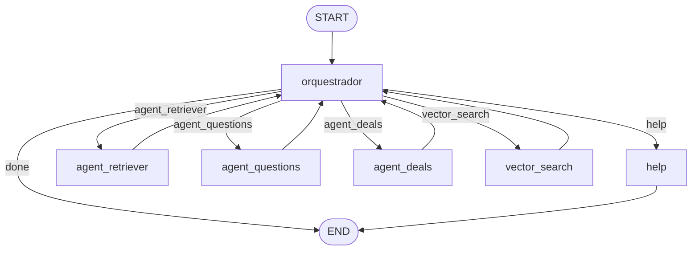

# ML Agents documentation

## Agent graph

The service runs a **LangGraph** state machine compiled in [`src/graph/agent-graph.ts`](../src/graph/agent-graph.ts). The orchestrator node (`orquestrador`) picks one route per turn; tool nodes return to the orchestrator for replanning until the model chooses `done` or limits apply (max planner cycles: 12).

- **Conditional edges** from `orquestrador` are driven by `state.orchestration.route` (see [`src/graph/orchestration-schema.ts`](../src/graph/orchestration-schema.ts)).
- **Loop-back** edges: after `agent_retriever`, `agent_questions`, `agent_deals`, or `vector_search`, execution returns to `orquestrador` with an updated `trace` for the next decision.
- **Terminal** paths: `help` and `done` end the run.

---

Agent-specific guides (use these paths from the repo root; links work in GitHub and most Markdown viewers):

- [Agent retriever](agent_retriever/README.md) — Mercado Livre question payload CLI
- [Agent questions](agent_questions/README.md) — draft seller replies from prepared questions
- [Agent deals](agent_deals/README.md) — list seller promotion invitations (Mercado Livre seller-promotions)
- [Orchestrator CLI](orchestrator/README.md) — route and chain retriever/questions/vector operations
- [Run logs](run_logs/README.md) — JSONL event structure and token telemetry
- [Token usage & cost](tokens-usage/README.md) — per-agent averages, orchestrator flows, cost notes
- [frontTest UI](frontTest/README.md) — run and configure the React test client

## Run logs

Structured JSON lines per day: `logs/agents-YYYY-MM-DD.jsonl` (see `docs/run_logs/README.md`). Emitted for `agent_retriever`, `agent_questions`, `agent_deals`, and `POST /invoke`.

## frontTest (optional UI)

Run from `frontTest/` with `npm run dev`. Full setup and proxy mapping lives in `docs/frontTest/README.md`.
