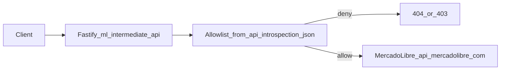

# Mercado Libre catch-all proxy (from `api_introspection.json`)

This document is a **snapshot copy** of the execution plan for historical reference.

Source plan (Cursor plan file): `/home/aka_nio/.cursor/plans/ml_api_catch-all_proxy_d888a599.plan.md`

## Reality check (why not “one Fastify route per JSON row”)

- [`docs/mercado_livre/api_introspection.json`](../mercado_livre/api_introspection.json) is **OPTIONS metadata**, not a complete OpenAPI catalog; it currently contains ~49 discovered roots, but the real ML surface includes **dynamic paths** (`/items/MLB...`, `/users/123`, etc.).
- A **catch-all proxy + allowlist** matches the intended approach and scales: it “covers every path implied by the JSON” while still allowing real calls under those roots.

## Target behavior

- Expose **`/api/ml-proxy/*`** (namespaced away from existing `/api/mercado-livre/...` routes).
- Support **GET/POST/PUT/PATCH/DELETE/OPTIONS** (and `HEAD` if you want trivial passthrough).
- **Always** attach upstream auth using server env `ML_TOKEN_SECRET` (do not require clients to send ML tokens).
- **Allowlist** derived at startup from the JSON:
  - Read [`docs/mercado_livre/api_introspection.json`](../mercado_livre/api_introspection.json)
  - Collect `endpoints[].path` values (normalize: trim, ensure leading `/`, drop querystrings)
  - Also harvest paths from `body.methods[].example` when present and `body` parses as object (optional but improves coverage)
  - Treat each collected path as a **prefix allow**: permit requests where `upstreamPath === allowed` OR `upstreamPath.startsWith(allowed + "/")`
  - Reject everything else with **404** (or **403** if you prefer “hidden” behavior)

## Upstream forwarding rules (security + correctness)

- Upstream base URL: default `https://api.mercadolibre.com`, overridable via env (e.g. `ML_API_BASE_URL`) for testing.
- Build upstream URL as: `${ML_API_BASE_URL}${upstreamPath}${search}` where `upstreamPath` is the wildcard remainder after `/api/ml-proxy`.
- Strip/normalize dangerous patterns (`..`, backslashes); cap path length.
- Forward **most headers** selectively:
  - Always set `Authorization: Bearer ${ML_TOKEN_SECRET}`
  - Forward `content-type`, `accept`, `accept-language` (optional), and any ML-specific headers you discover you need later
  - Do **not** forward client `authorization` to upstream (avoid accidental token override / leakage semantics)
- Forward body for non-GET/HEAD methods using `request.body` when JSON; for raw bodies, prefer streaming/`rawBody` approach if needed (Fastify content-type dependent).

## Code structure (match existing patterns)

- Add a small module to load/validate allowlist:
  - [`src/api/mercado_livre/ml_proxy/allowlist.ts`](../../src/api/mercado_livre/ml_proxy/allowlist.ts)
- Add proxy route plugin:
  - [`src/api/mercado_livre/routes/mlProxy.routes.ts`](../../src/api/mercado_livre/routes/mlProxy.routes.ts)
- Add a thin service if logic grows:
  - [`src/api/mercado_livre/services/mlProxy.service.ts`](../../src/api/mercado_livre/services/mlProxy.service.ts)

## Wire-up

- Register the new routes plugin from [`src/api/routes/mainPublic.routes.ts`](../../src/api/routes/mainPublic.routes.ts) alongside existing Mercado Livre routes.

## Docs

- Add endpoint doc: `docs/API/endpoints/mercado-livre-ml-proxy.md`
- Update `docs/API/README.md` and root `README.md` links.

## Tests (lightweight)

- Add a Vitest suite that mocks `fetch` and verifies:
  - blocked path returns 404/403
  - allowed prefix forwards to correct upstream URL
  - `Authorization` header is injected
  - query string preserved

## Operational notes (called out in docs)

- Some rows in your JSON show `403 PolicyAgent` for `OPTIONS`; the proxy still allows those roots if they appear in the JSON, because **GET may work** even when introspection fails in some networks.
- This is still not “every ML endpoint in the universe”—it’s “every endpoint root discovered in the introspection artifact”. To widen coverage, expand seeds / increase crawl limits in [`src/scripts/ml-api-introspect.ts`](../../src/scripts/ml-api-introspect.ts) and regenerate JSON.

